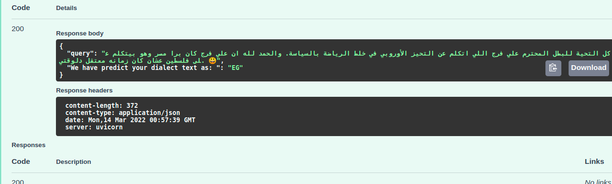
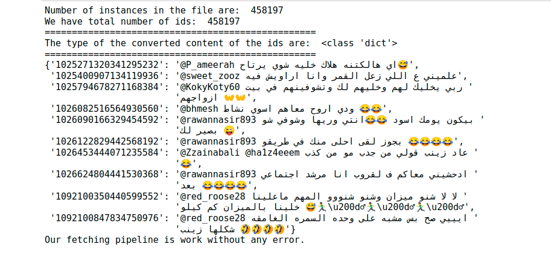
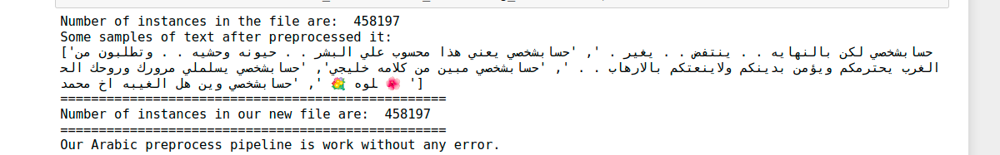
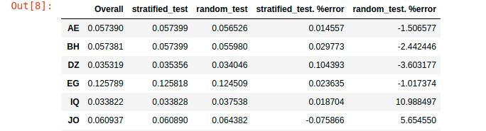
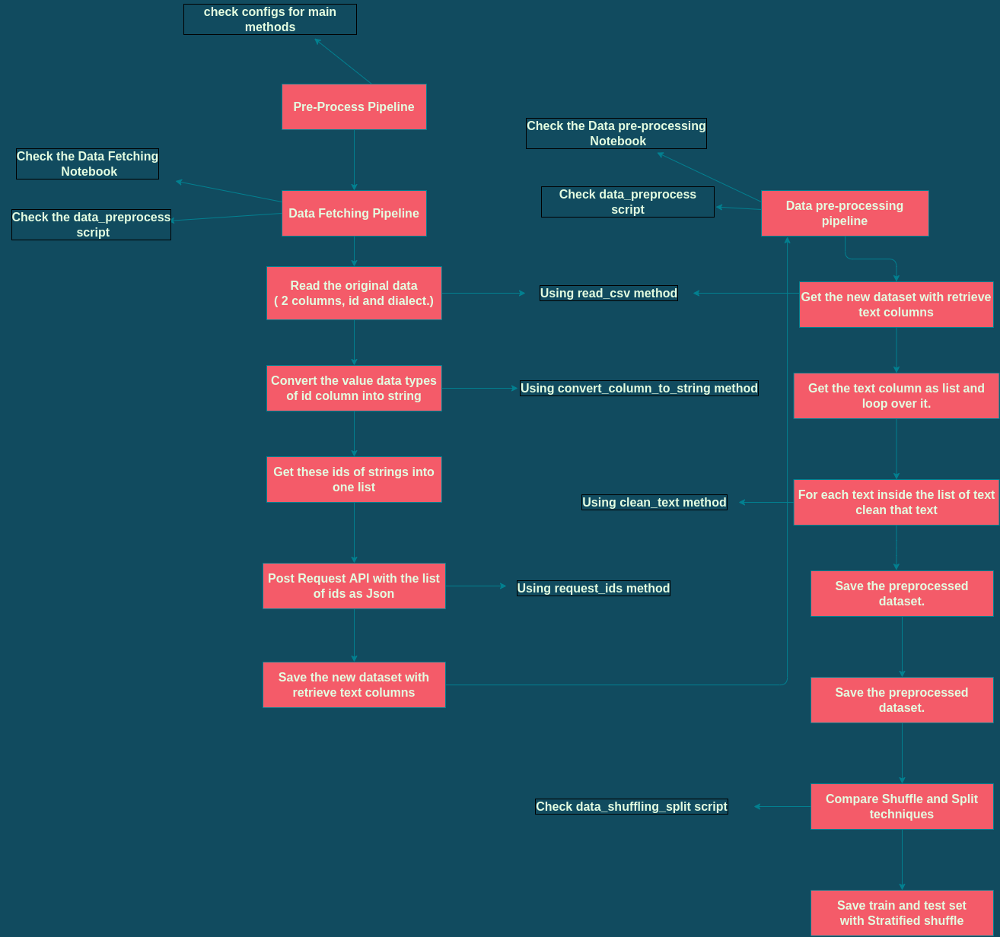
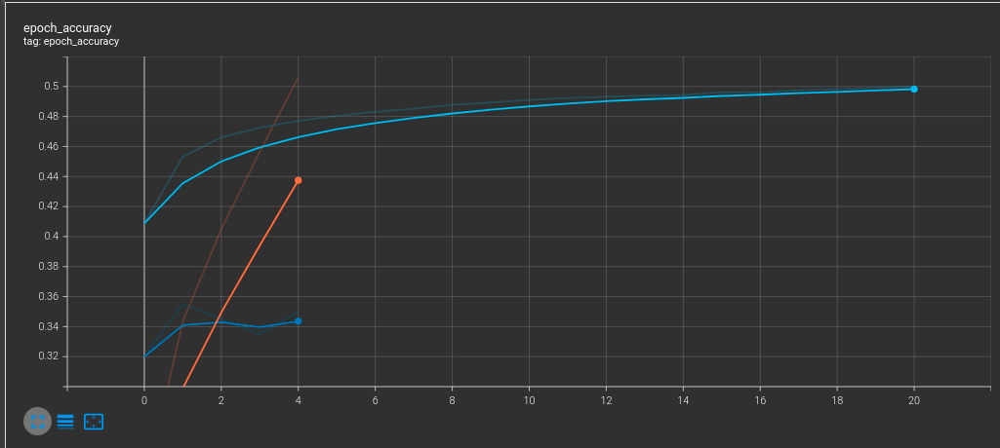

# Arabic Dialect Identification - NLP Model


## Many countries speak Arabic; however, each country has its own dialect, the aim of this repo is to build a model that predicts the dialect given the text.

In this work we have passed through different phases from fetching the data, to process it, shuffle the data for the next stage of preparation and run the model on. And how we come over these stages is decribed below.


## How To Use

First important, you need to install the requirements using snip code below, in case of missed libraries error try to pip3 install "name of library" like in snap code below.

```python

pip3 install -r requirements.txt

# in case of missed libraries error
pip3 install nltk



## Word2Vec

Second important, We have used word2vec for word representation, we used some pretrained word2vec published [AraVec](https://www.sciencedirect.com/science/article/pii/S1877050917321749) by Eng. Abo Bakr and others,
we used lightweight ones which use just unigrams, and as well as our pretrained one. So to come over this:

- First, check Server requirements notebook you can find here [Server requirements](https://github.com/al0olo/Arabic-Dialect-Identification/blob/main/Server%20requirements.ipynb)
- mkdir new direction inside models direction downloaded
	- in "models" direction should have "word2vec/downloaded_models"
- Second, run the notebook to download these word2vec models.
- Third, extract the zip files, and get the files inside into same downloaded zip , remove zip.

## dataset

The dataset after fetching it from API is larger than 50 Miga, and we can not pushed to github so we have compress it, and you can extract it, but you can also run into the models directly by unzip the trained dataset inside "train" direction , and escape either fetching data or preprocess it, we save our work after each stage.

### To go from scratch:
- First run Data Fetching notebook
- Then, run Data pre-processing
- Third, go to the machine learning or deep learning notebooks.
- Or, using the Deployment FastAPI notebook to check with your cases.


## Next, what we done !


### Configs

Helpful script to keep of some functions that we use in different files.

**To see this file, check the [configs.py script](https://github.com/al0olo/Arabic-Dialect-Identification/blob/main/configs.py) script, its fully documented.**

### Data Fetching

We have the original dataset without the text column, which what we will use for feature engineering to predict which text belong to which dialect. So for that we have design our pipeline for fetching the data using the ids of the original dataset, once we get all of text related to all ids we save new csv file with the new text column.

### How we passed through this stage:

- First read the original dataset file.
- Then, convert the data types of values in id column of the original dataset into string instead of integer.
- Then, get that column as list of strings each of these string art is related to tweet.
- Then, loop over batches of maximum 1000 of ids and call the APIs to get corresponding tweets of these ids.
- Then, handle requirements for saving new csv file with the new text column.


**To see this stage of fetching data, check the [fetch_data.py script](https://github.com/al0olo/Arabic-Dialect-Identification/blob/main/fetch_data.py) script, its fully documented, and to get overview of the result from this stage check [Data Fetching.ipynb notebook](https://github.com/al0olo/Arabic-Dialect-Identification/blob/main/Data%20Fetching.ipynb).**

**Quick intuition about what we got from this stage**




### Data pre-processing

The first thing we started with after fetching the data is to process the text we got, and at this point as 
we dealing with Arabic text we start the cleaning process.


### How we passed through this stage:

- Encode the dialects into numbers
- Replace url with Non-standard Arabic name (رابطويب)
- Replace mentions with Non-standard Arabic name (حسابشخصي)
- Remove diacritics
	The Arabic language has some of its own features that make it an amazing language, but some of these things need to be handled because it consumes process, memory and maybe lead to missing actual information, as we will have same words with multiple forms.
	Char that we aimed to delete like [like: َ" ُ ْ "]
- Remove part of appeared special chars like /U000f
- Some special replacement like ['&quot;', "أ", "إ", "آ", "ة"] to [' ', "ا", "ا", "ا", "ه"]
- Multiple emojis coming sequentially leave just one of them
- Separate numbers associated with words as well as English with Arabic words
- Remove char repeated more that two times sequentially
- Remove more spaces
- Save the data after preprocessing
- Split the data into training and testing sets, and use the Stratified split to ensure we have approximate distribution with original data.

**To see this stage of preprocessing data, check the [data_preprocess.py script](https://github.com/al0olo/Arabic-Dialect-Identification/blob/main/data_preprocess.py) and to know how we shuffle the data, check the [data_shuffling_split.py script](https://github.com/al0olo/Arabic-Dialect-Identification/blob/main/data_shuffling_split.py) its fully documented, and to get overview of the result from this stage check [Data pre-processing.ipynb notebook](https://github.com/al0olo/Arabic-Dialect-Identification/blob/main/Data%20pre-processing.ipynb).**

**Quick intuition about preprocessing and shuffling**



**Comparison the different splitting with the original data**

|

### Data preparation &  Modeling

After we have the data and splited with Stratified splitting, we have to get features (numbers) from that text as any ML models or DL models just fit to numbers.

So we use one of the modern approaches to get representation of each word "Word2Vec", instead of classical approaches like Vectorization or tf-idf and the the problems it runs from, either in encoding the context or the curse of dimension.

Once we got these word representation and run the required functions to convert from word representation into text representation, we run into the modeling phase and train different models as table below present the different results we got.

### How we passed through this stage:

- Read the training data
- Split the data into training and validation.
- Tokenize the training and validation text to get token representation.
- Read the word2vec model to use.
- Initialize the required variables.
- Train different Machine Learning & Deep Learning Models

**To see this stage of Data preparation &  Modeling, check the [ml_modeling.py script](https://github.com/al0olo/Arabic-Dialect-Identification/blob/main/ml_modeling.py), and [keras_models.py](https://github.com/al0olo/Arabic-Dialect-Identification/blob/main/keras_models.py) its fully documented, and to get overview of the result from this stage after run the notebooks check [ML Models Train.ipynb notebook](https://github.com/al0olo/Arabic-Dialect-Identification/blob/main/ML%20Models%20Train.ipynb), and  and [DL Models Train.ipynb notebook](https://github.com/al0olo/Arabic-Dialect-Identification/blob/main/DL%20Models%20Train.ipynb)**


### Result of Testing and what we use in our API

**To see result of modeling, check the [Compare ML Models.ipynb Notebook](https://github.com/al0olo/Arabic-Dialect-Identification/blob/main/Compare%20ML%20Models.ipynb), or [Compare DL Models.ipynb Notebook](https://github.com/al0olo/Arabic-Dialect-Identification/blob/main/Compare%20DL%20Models.ipynb).**


## Results with Machine Learning Models

Word2Vec Used | Model Used | F1-score|
------------- | ---------- | ------- |
AraVec word Representation | AdaBoostClassifier | .32|
AraVec word Representation | Logistic Regression| .36|
Our word Representation    | Logistic Regression| .41|
Our word Representation    | GradientBoostingClassifier| .22|
Our word Representation    | LinearSVC| .27|

## Results with Deep Learning Models

Word2Vec Used | Model, Optimizer, Batching | F1-score|
------------- | -------------------------- | ------- |
AraVec word Representation | LSTM, SGD, No Batch | .47|
AraVec word Representation | LSTM, SGD, Batch| .46|
AraVec word Representation | LSTM, Adam, No Batch| .47|
AraVec word Representation | LSTM, Adam, Batch| .47|
Our word Representation    | LSTM, SGD, No Batch| .51|
Our word Representation    | LSTM, SGD, Batch| .49|
Our word Representation    | LSTM, Adam, No Batch| .51|


**Overview about the work till splitting data**



**Overview about Modeling using Tensorboard**



